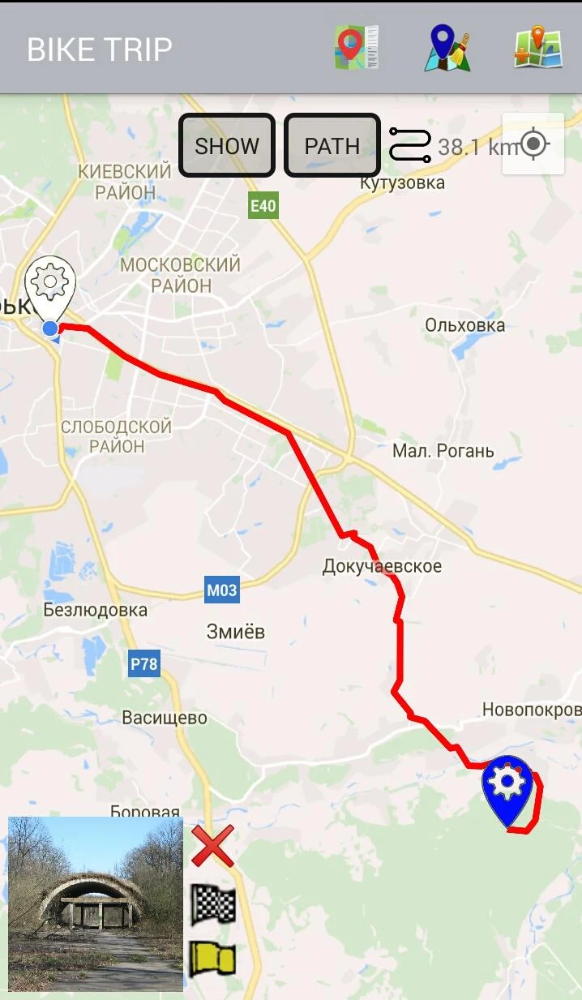
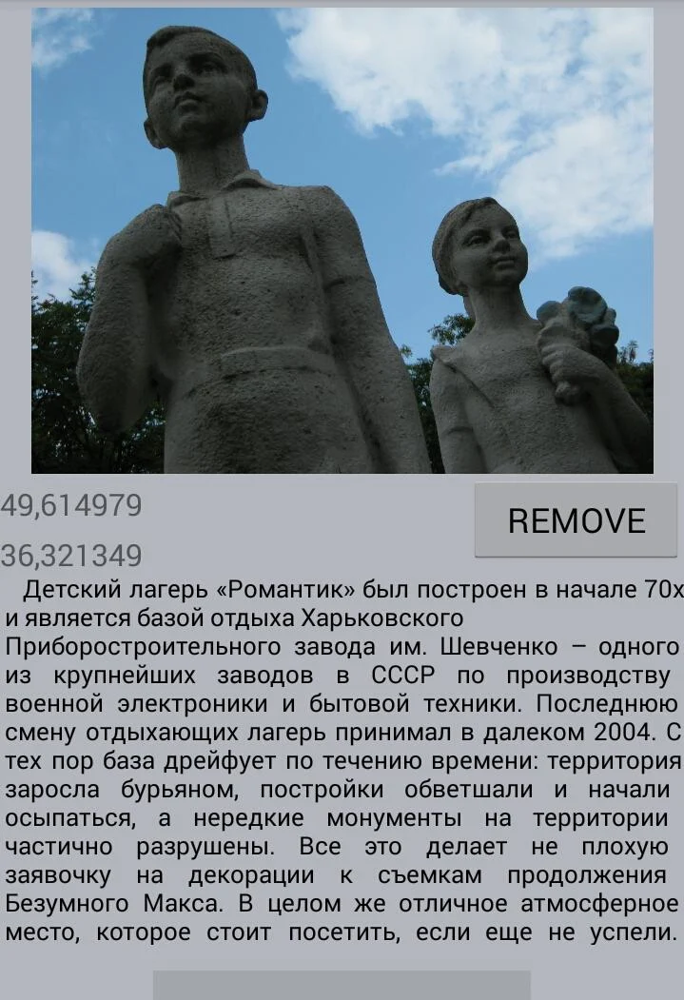
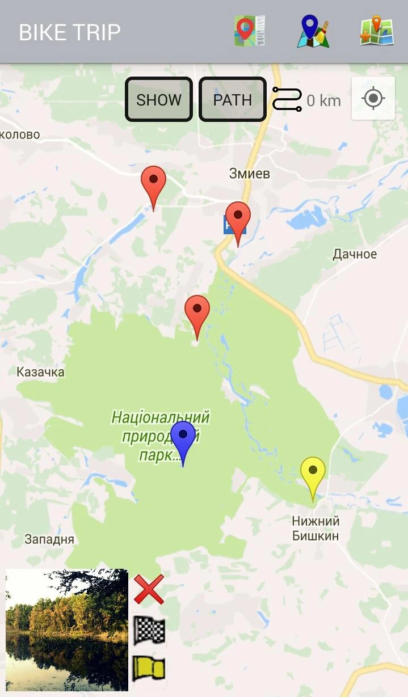
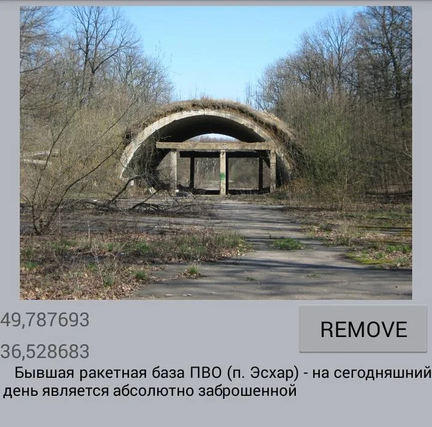

# brisk-bike-navigator 2.0

<h3>Project description:</h3>
Who doesn't like cycling or moto trips? There aren't only benefits for your health but a lot of 
interesting sceneries you can watch during your cycling time. Some new places of interest... which, 
maybe, you will like to visit one more time. This APP will be handy to use for such goals: just take 
a picture of an interesting scenery, add some description if you want, and it automatically will be 
saved into storage. If you have list of such places, it will be represented in Google Map automatically 
since you start this APP. Mind, you can combine a route using markers to obtain total distance to  
destination point. Also you can include transit markers. Expand your area of cycling and share 
interesting places with your friends! 

<h3>Some interesting features:</h3>
- available storage for your data 
- some interesting places to visit will be represented from Kharkiv region, strictly speaking, from 
  Zmiiv district, since I'm from here. Welcome) 
- you can planned your route according to total distance resolved by Google Maps API 

<h3>In this APP were used such technologies, tools, libraries like:</h3>
- Google PLay Maps API 
- JustifyTestView (my custom class for text aligning) 
- SQLiteOpenHelper 
- MediaStore 

<h3>Instructions for assembling and running the application:</h3>
- To install from Google Play Market just follow the link: 
  https://play.google.com/store/apps/details?id=brisk.bike.navigator 
  It's supported for android 4.4.2 (KitKat) and more high versions. 
- Not the easiest way: you have to be the developer environment available (to build the application, you 
  need JDK, Git Android Studio installed + all needed drivers and libraries 
  (Tools -> SDK Manager -> SDK Tools). 
- You need the Goggle Map Key for working your APP properly (https://console.cloud.google.com/). 
  You have to put it in res/values/strings. 
- You have to tune your phone on developer environment option. 
  Connect your physical device and load APK file (Rebuild project + Run app). 

<h3>Some screenshots from the app:</h3>
<body>
  

  

 </body>
